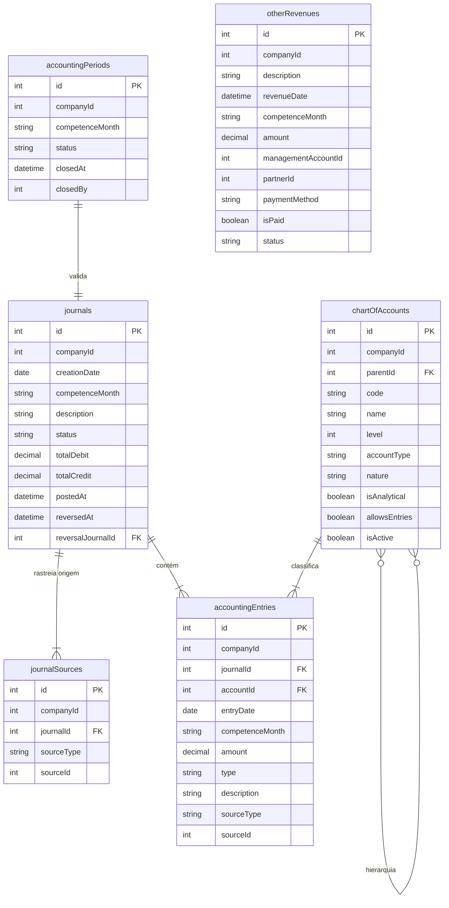

# Módulo Contábil - ERP Adega Beira Rio

**Versão:** 2.0 (Consolidada)  
**Data:** 04/02/2026  
**Status:** Pronto para Implementação  
**Autor:** Aurora (Manus AI) com revisão de Orion e Gabriel (PO)

---

## 1. Sumário Executivo

O módulo contábil foi estruturado para automatizar a contabilização de receitas, despesas e demais movimentações do ABRWF, seguindo padrões contábeis brasileiros e boas práticas de engenharia. A arquitetura foi validada pela ferramenta de análise Orion e garante integridade de dados, auditoria completa e idempotência em todas as operações.

### Objetivos

- ✅ Estrutura de banco de dados robusta e escalável (multiempresa)
- ✅ Plano de Contas hierárquico com padrão brasileiro correto (6 grupos)
- ✅ Sistema de lotes (journals) com ciclo de vida controlado
- ✅ Ponte de auditoria (journalSources) para rastreabilidade total
- ✅ Lógica de contabilização automática de receitas
- ✅ Validações de integridade (partida dobrada, competência, idempotência)
- ✅ Relatórios contábeis (Razão, Balanço, DRE)
- ✅ Interface de gestão do Plano de Contas

---

## 2. Situação Atual

### 2.1 Tabelas Existentes

| Tabela | Registros | Status | Descrição |
|--------|-----------|--------|-----------|
| `managementAccounts` | 50 | ✅ Populada | Contas gerenciais (COP, DAD, DOP, etc.) |
| `accountingMappings` | 50 | ✅ Populada | Mapeamento gerencial → contábil |
| `chartOfAccounts` | 0 | ❌ Vazia | Plano de contas contábil hierárquico |
| `revenueAccounts` | 7 | ✅ Populada | Contas de receita para vendas |
| `revenueEntries` | 122.668 | ✅ Populada | Lançamentos de vendas |

### 2.2 Estrutura de Contas Gerenciais Existente

| Prefixo | Natureza | Classificação | Exemplos |
|---------|----------|---------------|----------|
| COP | CUSTO | OPERACIONAL | Embalagens, Material de Limpeza, Gás |
| DOP | DESPESA | OPERACIONAL | Aluguel, IPTU, Energia |
| DAD | DESPESA | ADMINISTRATIVA | Consultoria, Software, Contabilidade |
| DCO | DESPESA | COMERCIAL | Marketing, Comissões |
| DFI | DESPESA | FINANCEIRA | Juros, Tarifas Bancárias |
| PAT | PATRIMONIAL | PATRIMONIAL | Imobilizados |

---

## 3. Arquitetura de Dados

### 3.1 Diagrama Entidade-Relacionamento



---

## 4. Plano de Contas - Padrão Brasileiro (6 Grupos)

### 4.1 Estrutura Hierárquica

| Grupo | Descrição | Natureza | Tipo |
|:---:|:---|:---:|:---:|
| **1** | ATIVO | Devedora | Balanço |
| **2** | PASSIVO | Credora | Balanço |
| **3** | PATRIMÔNIO LÍQUIDO | Credora | Balanço |
| **4** | RECEITAS | Credora | DRE |
| **5** | CUSTOS | Devedora | DRE |
| **6** | DESPESAS | Devedora | DRE |

### 4.2 Níveis do Plano de Contas

| Nível | Formato | Exemplo | Tipo |
|-------|---------|---------|------|
| 1 | X | 1, 2, 3, 4, 5, 6 | Sintética (Grupo) |
| 2 | X.X | 1.1, 1.2, 4.1 | Sintética (Subgrupo) |
| 3 | X.X.X | 1.1.1, 4.1.1 | Sintética (Conta) |
| 4 | X.X.X.XX | 1.1.1.01, 4.1.1.01 | Analítica (Subconta) |

### 4.3 Estrutura Detalhada

#### Grupo 1: ATIVO
```
1 - ATIVO (Sintética, Devedora)
├─ 1.1 - ATIVO CIRCULANTE (Sintética)
│  ├─ 1.1.1 - CAIXA E EQUIVALENTES (Sintética)
│  │  ├─ 1.1.1.01 - Caixa Geral (Analítica) ✓ Débito
│  │  ├─ 1.1.1.02 - Banco Itaú (Analítica) ✓ Débito
│  │  ├─ 1.1.1.03 - Banco Santander (Analítica) ✓ Débito
│  │  ├─ 1.1.1.04 - Banco Bradesco (Analítica) ✓ Débito
│  │  └─ 1.1.1.05 - Banco do Brasil (Analítica) ✓ Débito
│  ├─ 1.1.2 - CONTAS A RECEBER (Sintética)
│  │  ├─ 1.1.2.01 - Clientes A Prazo (Analítica) ✓ Débito
│  │  ├─ 1.1.2.02 - iFood a Receber (Analítica) ✓ Débito
│  │  └─ 1.1.2.03 - (-) Provisão Devedores Duvidosos (Analítica)
│  ├─ 1.1.3 - ESTOQUES (Sintética)
│  │  ├─ 1.1.3.01 - Mercadorias para Revenda (Analítica)
│  │  └─ 1.1.3.02 - Material de Consumo (Analítica)
│  └─ 1.1.4 - OUTROS CRÉDITOS (Sintética)
│     ├─ 1.1.4.01 - Adiantamentos a Fornecedores (Analítica)
│     └─ 1.1.4.02 - Impostos a Recuperar (Analítica)
└─ 1.2 - ATIVO NÃO CIRCULANTE (Sintética)
   ├─ 1.2.1 - IMOBILIZADO (Sintética)
   │  ├─ 1.2.1.01 - Equipamentos (Analítica)
   │  ├─ 1.2.1.02 - Móveis e Utensílios (Analítica)
   │  ├─ 1.2.1.03 - Benfeitorias (Analítica)
   │  └─ 1.2.1.04 - (-) Depreciação Acumulada (Analítica)
   └─ 1.2.2 - INTANGÍVEL (Sintética)
      └─ 1.2.2.01 - Softwares (Analítica)
```

#### Grupo 2: PASSIVO
```
2 - PASSIVO (Sintética, Credora)
├─ 2.1 - PASSIVO CIRCULANTE (Sintética)
│  ├─ 2.1.1 - FORNECEDORES (Sintética)
│  │  └─ 2.1.1.01 - Fornecedores Nacionais (Analítica) ✓ Crédito
│  ├─ 2.1.2 - OBRIGAÇÕES TRABALHISTAS (Sintética)
│  │  ├─ 2.1.2.01 - Salários a Pagar (Analítica)
│  │  ├─ 2.1.2.02 - INSS a Recolher (Analítica)
│  │  └─ 2.1.2.03 - FGTS a Recolher (Analítica)
│  ├─ 2.1.3 - OBRIGAÇÕES TRIBUTÁRIAS (Sintética)
│  │  ├─ 2.1.3.01 - Simples Nacional a Recolher (Analítica)
│  │  └─ 2.1.3.02 - ISS a Recolher (Analítica)
│  └─ 2.1.4 - OUTRAS OBRIGAÇÕES (Sintética)
│     └─ 2.1.4.01 - Contas a Pagar Diversas (Analítica)
└─ 2.2 - PASSIVO NÃO CIRCULANTE (Sintética)
   └─ 2.2.1 - EMPRÉSTIMOS E FINANCIAMENTOS (Sintética)
      └─ 2.2.1.01 - Financiamentos Bancários (Analítica)
```

#### Grupo 3: PATRIMÔNIO LÍQUIDO
```
3 - PATRIMÔNIO LÍQUIDO (Sintética, Credora)
├─ 3.1 - CAPITAL SOCIAL (Sintética)
│  └─ 3.1.1.01 - Capital Integralizado (Analítica) ✓ Crédito
└─ 3.2 - RESULTADOS ACUMULADOS (Sintética)
   ├─ 3.2.1.01 - Lucros Acumulados (Analítica) ✓ Crédito
   └─ 3.2.1.02 - Prejuízos Acumulados (Analítica)
```

#### Grupo 4: RECEITAS
```
4 - RECEITAS (Sintética, Credora)
├─ 4.1 - RECEITA OPERACIONAL BRUTA (Sintética)
│  ├─ 4.1.1 - RECEITA DE VENDAS (Sintética)
│  │  ├─ 4.1.1.01 - Receita de Vendas (Balcão) (Analítica) ✓ Crédito
│  │  ├─ 4.1.1.02 - Receita de Vendas (A Prazo) (Analítica) ✓ Crédito
│  │  └─ 4.1.1.03 - Receita de Vendas (Delivery) (Analítica) ✓ Crédito
│  └─ 4.1.2 - DEDUÇÕES DA RECEITA (Sintética)
│     ├─ 4.1.2.01 - (-) Descontos Concedidos (Analítica)
│     └─ 4.1.2.02 - (-) Taxas de Delivery (Analítica)
├─ 4.2 - OUTRAS RECEITAS OPERACIONAIS (Sintética)
│  ├─ 4.2.1.01 - Receita de Aluguel (Analítica)
│  ├─ 4.2.1.02 - Receita de Serviços (Analítica)
│  └─ 4.2.1.03 - Outras Receitas (Analítica)
└─ 4.3 - RECEITAS FINANCEIRAS (Sintética)
   ├─ 4.3.1.01 - Juros Recebidos (Analítica)
   └─ 4.3.1.02 - Descontos Obtidos (Analítica)
```

#### Grupo 5: CUSTOS
```
5 - CUSTOS (Sintética, Devedora)
├─ 5.1 - CUSTO DAS MERCADORIAS VENDIDAS (Sintética)
│  └─ 5.1.1.01 - CMV - Custo sobre Vendas (Analítica) ✓ Débito
├─ 5.2 - CUSTOS OPERACIONAIS (Sintética)
│  ├─ 5.2.1 - CUSTOS DIRETOS (Sintética)
│  │  ├─ 5.2.1.01 - Embalagens (Analítica)
│  │  ├─ 5.2.1.02 - Material de Limpeza (Analítica)
│  │  ├─ 5.2.1.03 - Gás Encanado (Analítica)
│  │  ├─ 5.2.1.04 - Fretes (Analítica)
│  │  └─ 5.2.1.05 - Material de Consumo (Analítica)
│  └─ 5.2.2 - PERDAS (Sintética)
│     ├─ 5.2.2.01 - Perdas de Estoque (Analítica)
│     └─ 5.2.2.02 - Perdas Operacionais (Analítica)
└─ 5.3 - MANUTENÇÃO (Sintética)
   └─ 5.3.1.01 - Manutenção das Instalações (Analítica)
```

#### Grupo 6: DESPESAS
```
6 - DESPESAS (Sintética, Devedora)
├─ 6.1 - DESPESAS OPERACIONAIS (Sintética)
│  ├─ 6.1.1 - DESPESAS COM OCUPAÇÃO (Sintética)
│  │  ├─ 6.1.1.01 - Aluguel (Analítica) ✓ Débito
│  │  ├─ 6.1.1.02 - IPTU (Analítica)
│  │  ├─ 6.1.1.03 - Energia Elétrica (Analítica)
│  │  └─ 6.1.1.04 - Água e Esgoto (Analítica)
│  └─ 6.1.2 - DESPESAS ADMINISTRATIVAS (Sintética)
│     ├─ 6.1.2.01 - Consultoria e Assessoria (Analítica)
│     ├─ 6.1.2.02 - Software e Sistemas (Analítica)
│     └─ 6.1.2.03 - Contabilidade (Analítica)
├─ 6.2 - DESPESAS COMERCIAIS (Sintética)
│  ├─ 6.2.1.01 - Marketing e Publicidade (Analítica)
│  └─ 6.2.1.02 - Comissões sobre Vendas (Analítica)
├─ 6.3 - DESPESAS FINANCEIRAS (Sintética)
│  ├─ 6.3.1.01 - Juros Pagos (Analítica)
│  ├─ 6.3.1.02 - Tarifas Bancárias (Analítica)
│  └─ 6.3.1.03 - Taxas de Cartão (Analítica)
└─ 6.4 - DESPESAS COM PESSOAL (Sintética)
   ├─ 6.4.1.01 - Salários e Ordenados (Analítica)
   ├─ 6.4.1.02 - Encargos Sociais (Analítica)
   └─ 6.4.1.03 - Benefícios (Analítica)
```

### 4.4 Regras de Natureza (Débito/Crédito)

| Grupo | Natureza Normal | Aumenta com | Diminui com |
|-------|-----------------|-------------|-------------|
| 1 - Ativo | Devedora | Débito | Crédito |
| 2 - Passivo | Credora | Crédito | Débito |
| 3 - Patrimônio Líquido | Credora | Crédito | Débito |
| 4 - Receitas | Credora | Crédito | Débito |
| 5 - Custos | Devedora | Débito | Crédito |
| 6 - Despesas | Devedora | Débito | Crédito |

### 4.5 Conta Sintética vs Analítica

| Tipo | Permite Lançamento | Possui Filhos | Exemplo |
|------|-------------------|---------------|---------|
| **Sintética** | ❌ Não | ✅ Sim | 1.1 - Ativo Circulante |
| **Analítica** | ✅ Sim | ❌ Não | 1.1.1.01 - Caixa Geral |

**Regra:** Apenas contas analíticas (nível 4) podem receber lançamentos contábeis.

---

## 5. Mapeamento Contábil de Receitas

### 5.1 Regra de Negócio: Origem + Canal → Contas

| Origem | Canal | Débito (D) | Crédito (C) | Descrição |
|:---|:---|:---|:---|:---|
| `PDV` | `BALCAO` | 1.1.1.01 | 4.1.1.01 | Venda à vista no balcão |
| `PDV` | `A_PRAZO` | 1.1.2.01 | 4.1.1.02 | Venda a prazo (cliente) |
| `iFood` | `DELIVERY` | 1.1.2.02 | 4.1.1.03 | Venda via iFood (a receber) |
| `iFood` | `IFOOD` | 1.1.2.02 | 4.1.1.03 | Venda via iFood (a receber) |

### 5.2 Fluxos de Contabilização

#### Vendas
```
Venda Balcão R$ 100,00:
  D - 1.1.1.01 Caixa Geral           100,00
  C - 4.1.1.01 Vendas Balcão         100,00

Venda A Prazo R$ 100,00:
  D - 1.1.2.01 Clientes A Prazo      100,00
  C - 4.1.1.02 Vendas A Prazo        100,00

Venda Delivery R$ 100,00:
  D - 1.1.2.02 iFood a Receber       100,00
  C - 4.1.1.03 Vendas Delivery       100,00
```

#### Compras
```
Compra de Mercadorias R$ 500,00:
  D - 1.1.3.01 Mercadorias           500,00
  C - 2.1.1.01 Fornecedores          500,00

Pagamento ao Fornecedor:
  D - 2.1.1.01 Fornecedores          500,00
  C - 1.1.1.02 Banco Itaú            500,00
```

#### Despesas
```
Despesa de Aluguel R$ 3.000,00:
  D - 6.1.1.01 Aluguel             3.000,00
  C - 2.1.4.01 Contas a Pagar      3.000,00

Pagamento do Aluguel:
  D - 2.1.4.01 Contas a Pagar      3.000,00
  C - 1.1.1.02 Banco Itaú          3.000,00
```

#### Outras Receitas
```
Receita de Aluguel R$ 1.000,00:
  D - 1.1.1.02 Banco Itaú          1.000,00
  C - 4.2.1.01 Receita de Aluguel  1.000,00
```

---

## 6. Schemas Drizzle (TypeScript)

### 6.1 chartOfAccounts

```typescript
export const chartOfAccounts = mysqlTable("chartOfAccounts", {
  id: int("id").primaryKey().autoincrement(),
  companyId: int("companyId").notNull(),
  parentId: int("parentId"),
  code: varchar("code", { length: 20 }).notNull(),
  name: varchar("name", { length: 150 }).notNull(),
  level: int("level").notNull(),
  accountType: mysqlEnum("accountType", [
    "ATIVO", "PASSIVO", "PL", "RECEITA", "CUSTO", "DESPESA"
  ]).notNull(),
  nature: mysqlEnum("nature", ["DEVEDORA", "CREDORA"]).notNull(),
  isAnalytical: boolean("isAnalytical").notNull(),
  allowsEntries: boolean("allowsEntries").notNull(),
  isActive: boolean("isActive").default(true).notNull(),
  displayOrder: int("displayOrder").default(0),
  createdAt: timestamp("createdAt").defaultNow(),
  updatedAt: timestamp("updatedAt").defaultNow().onUpdateNow(),
}, (table) => ({
  codeCompanyIdx: uniqueIndex("code_company_idx").on(table.companyId, table.code),
  parentIdx: index("parent_idx").on(table.parentId),
}));
```

### 6.2 journals

```typescript
export const journals = mysqlTable("journals", {
  id: int("id").primaryKey().autoincrement(),
  companyId: int("companyId").notNull(),
  creationDate: timestamp("creationDate").defaultNow().notNull(),
  competenceMonth: varchar("competenceMonth", { length: 7 }).notNull(), // "2026-02"
  description: varchar("description", { length: 255 }),
  status: mysqlEnum("status", ["DRAFT", "POSTED", "REVERSED"]).default("DRAFT").notNull(),
  totalDebit: decimal("totalDebit", { precision: 15, scale: 2 }).default("0.00"),
  totalCredit: decimal("totalCredit", { precision: 15, scale: 2 }).default("0.00"),
  postedAt: timestamp("postedAt"),
  reversedAt: timestamp("reversedAt"),
  reversalJournalId: int("reversalJournalId"),
  createdBy: varchar("createdBy", { length: 64 }),
  createdAt: timestamp("createdAt").defaultNow(),
}, (table) => ({
  companyIdx: index("company_idx").on(table.companyId),
  competenceIdx: index("competence_idx").on(table.competenceMonth),
  statusIdx: index("status_idx").on(table.status),
}));
```

### 6.3 accountingEntries

```typescript
export const accountingEntries = mysqlTable("accountingEntries", {
  id: int("id").primaryKey().autoincrement(),
  companyId: int("companyId").notNull(),
  journalId: int("journalId").notNull(),
  accountId: int("accountId").notNull(),
  entryDate: timestamp("entryDate").notNull(),
  competenceMonth: varchar("competenceMonth", { length: 7 }).notNull(),
  amount: decimal("amount", { precision: 15, scale: 2 }).notNull(),
  entryType: mysqlEnum("entryType", ["D", "C"]).notNull(), // D = Débito, C = Crédito
  description: varchar("description", { length: 255 }),
  sourceType: varchar("sourceType", { length: 100 }),
  sourceId: int("sourceId"),
  createdAt: timestamp("createdAt").defaultNow(),
}, (table) => ({
  journalIdx: index("journal_idx").on(table.journalId),
  accountIdx: index("account_idx").on(table.accountId),
  dateIdx: index("entry_date_idx").on(table.entryDate),
  competenceIdx: index("competence_month_idx").on(table.competenceMonth),
}));
```

### 6.4 journalSources

```typescript
export const journalSources = mysqlTable("journalSources", {
  id: int("id").primaryKey().autoincrement(),
  companyId: int("companyId").notNull(),
  journalId: int("journalId").notNull(),
  sourceType: varchar("sourceType", { length: 100 }).notNull(),
  sourceId: int("sourceId").notNull(),
  createdAt: timestamp("createdAt").defaultNow(),
}, (table) => ({
  journalIdx: index("journal_source_idx").on(table.journalId),
  uniqueSource: uniqueIndex("unique_source_idx").on(table.companyId, table.journalId, table.sourceType, table.sourceId),
}));
```

### 6.5 accountingPeriods

```typescript
export const accountingPeriods = mysqlTable("accountingPeriods", {
  id: int("id").primaryKey().autoincrement(),
  companyId: int("companyId").notNull(),
  competenceMonth: varchar("competenceMonth", { length: 7 }).notNull(), // "2026-02"
  status: mysqlEnum("status", ["OPEN", "CLOSED"]).default("OPEN").notNull(),
  closedAt: timestamp("closedAt"),
  closedBy: varchar("closedBy", { length: 64 }),
  createdAt: timestamp("createdAt").defaultNow(),
}, (table) => ({
  uniquePeriod: uniqueIndex("unique_period_idx").on(table.companyId, table.competenceMonth),
}));
```

### 6.6 otherRevenues

```typescript
export const otherRevenues = mysqlTable("otherRevenues", {
  id: int("id").primaryKey().autoincrement(),
  companyId: int("companyId").notNull(),
  description: varchar("description", { length: 255 }).notNull(),
  revenueDate: timestamp("revenueDate").notNull(),
  competenceMonth: varchar("competenceMonth", { length: 7 }).notNull(),
  amount: decimal("amount", { precision: 15, scale: 2 }).notNull(),
  managementAccountId: int("managementAccountId").notNull(),
  partnerId: int("partnerId"),
  paymentMethod: varchar("paymentMethod", { length: 50 }),
  isPaid: boolean("isPaid").default(false),
  paidAt: timestamp("paidAt"),
  isRecurring: boolean("isRecurring").default(false),
  recurrenceType: mysqlEnum("recurrenceType", ["MENSAL", "TRIMESTRAL", "ANUAL"]),
  recurrenceEndDate: timestamp("recurrenceEndDate"),
  status: mysqlEnum("status", ["ACTIVE", "CANCELLED"]).default("ACTIVE").notNull(),
  notes: text("notes"),
  isAccounted: boolean("isAccounted").default(false),
  accountedJournalId: int("accountedJournalId"),
  createdBy: varchar("createdBy", { length: 64 }).notNull(),
  createdAt: timestamp("createdAt").defaultNow(),
  updatedAt: timestamp("updatedAt").defaultNow().onUpdateNow(),
}, (table) => ({
  companyIdx: index("company_revenue_idx").on(table.companyId),
  dateIdx: index("revenue_date_idx").on(table.revenueDate),
  competenceIdx: index("revenue_competence_idx").on(table.competenceMonth),
}));
```

---

## 7. Validações e Regras de Negócio

### 7.1 Validação de Integridade

| Regra | Implementação | Nível |
|:---|:---|:---:|
| Partida Dobrada | Débito = Crédito por journal | Transação |
| Competência Aberta | Status = 'OPEN' em `accountingPeriods` | Aplicação |
| Idempotência | UNIQUE `(companyId, sourceType, sourceId)` em `journalSources` | Banco |
| Contas Válidas | Verificação de existência antes de transação | Aplicação |
| Sem Duplicação | `isAccounted = false` na cláusula WHERE | Aplicação |
| Hierarquia de Contas | `parentId` referencia conta válida | Banco |
| Conta Analítica | Lançamentos apenas em contas analíticas | Aplicação |

### 7.2 Ciclo de Vida do Journal

```
DRAFT → POSTED → REVERSED
  ↓       ↓         ↓
Criado  Lançado  Estornado
        (D=C)    (ref. novo journal)
```

### 7.3 Validações do Plano de Contas

| Regra | Descrição |
|-------|-----------|
| **Código único** | Não pode haver códigos duplicados por empresa |
| **Hierarquia válida** | `parentId` deve existir e ser de nível inferior |
| **Nível correto** | Nível deve corresponder à quantidade de separadores no código |
| **Conta pai sintética** | Conta pai não pode ser analítica |
| **Exclusão segura** | Não pode excluir conta com lançamentos ou filhos |
| **Natureza consistente** | Filhos herdam natureza do pai |

---

## 8. Interface do Usuário

### 8.1 Menu de Navegação

```
Contabilidade
├── Plano de Contas Contábil
│   ├── Visualizar (árvore hierárquica)
│   ├── Criar conta
│   └── Editar conta
├── Plano de Contas Gerencial
│   ├── Listar contas
│   ├── Criar conta
│   ├── Editar conta
│   └── Gerenciar amarrações
├── Outras Receitas
│   ├── Listar receitas
│   ├── Nova receita
│   └── Receitas recorrentes
└── Relatórios
    ├── Razão Contábil
    ├── Balanço Patrimonial
    └── DRE
```

### 8.2 Tela: Plano de Contas Contábil

**Visualização em árvore:**
- Expandir/colapsar níveis
- Indicador visual de conta sintética vs analítica
- Badge de natureza (D/C)
- Ações: Editar, Adicionar filho, Desativar

**Formulário de criação:**
- Código (auto-sugerido baseado no pai)
- Nome
- Conta pai (seletor hierárquico)
- Tipo de conta (Sintética/Analítica)
- Natureza (herdada do grupo)

### 8.3 Tela: Razão Contábil

**Filtros:**
- Conta contábil (com autocomplete)
- Período (data inicial e final)
- Tipo de lançamento (Débito/Crédito/Todos)

**Colunas:**
- Data
- Histórico
- Débito
- Crédito
- Saldo
- Documento origem

**Totalizadores:**
- Saldo anterior
- Total débitos
- Total créditos
- Saldo final

### 8.4 Tela: Balanço Patrimonial

```
ATIVO                          | PASSIVO + PL
-------------------------------|-------------------------------
ATIVO CIRCULANTE        XX.XXX | PASSIVO CIRCULANTE      XX.XXX
  Disponibilidades      XX.XXX |   Fornecedores          XX.XXX
    Caixa               XX.XXX |   Obrig. Trabalhistas   XX.XXX
    Bancos              XX.XXX |   Obrig. Tributárias    XX.XXX
  Clientes              XX.XXX | PASSIVO NÃO CIRCULANTE  XX.XXX
  Estoques              XX.XXX |   Empréstimos           XX.XXX
ATIVO NÃO CIRCULANTE    XX.XXX | PATRIMÔNIO LÍQUIDO      XX.XXX
  Imobilizado           XX.XXX |   Capital Social        XX.XXX
  (-) Depreciação      (XX.XXX)|   Lucros Acumulados     XX.XXX
-------------------------------|-------------------------------
TOTAL ATIVO            XXX.XXX | TOTAL PASSIVO + PL     XXX.XXX
```

### 8.5 Tela: DRE

```
DEMONSTRAÇÃO DO RESULTADO DO EXERCÍCIO
Período: XX/XX/XXXX a XX/XX/XXXX

RECEITA OPERACIONAL BRUTA                    XXX.XXX
  Vendas Balcão                              XXX.XXX
  Vendas Delivery                            XXX.XXX
  Vendas A Prazo                             XXX.XXX

(-) DEDUÇÕES DA RECEITA                      (XX.XXX)
  Descontos Concedidos                       (XX.XXX)
  Taxas de Delivery                          (XX.XXX)

= RECEITA OPERACIONAL LÍQUIDA                XXX.XXX

(-) CUSTOS                                   (XX.XXX)
  CMV - Custo das Mercadorias Vendidas       (XX.XXX)
  Custos Operacionais                        (XX.XXX)

= LUCRO BRUTO                                XXX.XXX

(-) DESPESAS OPERACIONAIS                    (XX.XXX)
  Despesas com Ocupação                      (XX.XXX)
  Despesas Administrativas                   (XX.XXX)
  Despesas Comerciais                        (XX.XXX)
  Despesas com Pessoal                       (XX.XXX)

= RESULTADO OPERACIONAL                       XX.XXX

(+/-) RESULTADO FINANCEIRO                    (X.XXX)
  Receitas Financeiras                         X.XXX
  (-) Despesas Financeiras                   (XX.XXX)

(+) OUTRAS RECEITAS                            X.XXX

= RESULTADO LÍQUIDO DO EXERCÍCIO              XX.XXX
```

---

## 9. Função de Contabilização de Receitas

### 9.1 Pseudocódigo

```typescript
async function contabilizarReceitas(companyId: number, competenceMonth: string) {
  // 1. Validar competência aberta
  const period = await db.query.accountingPeriods.findFirst(...)
  if (!period || period.status === 'CLOSED') throw Error(...)

  // 2. Carregar contas em cache
  const accountMap = await loadAccountMap(companyId)
  
  // 3. Validar que todas as contas necessárias existem
  validateAccountMapCompleteness(accountMap)

  // 4. Loop de processamento em batches (até 500 por journal)
  while (true) {
    const pendingRevenues = await db.query.revenueEntries.findMany({
      where: and(
        eq(companyId, companyId),
        eq(isAccounted, false),
        eq(competenceMonth, competenceMonth)
      ),
      limit: 500
    })

    if (pendingRevenues.length === 0) break

    // 5. Executar em transação
    await db.transaction(async (tx) => {
      // 5.1. Criar journal em DRAFT
      const newJournal = await tx.insert(journals).values(...)

      // 5.2. Gerar entries e sources
      const entries = []
      const sources = []
      for (const revenue of pendingRevenues) {
        const { debitId, creditId } = getAccountIds(revenue, accountMap)
        entries.push({ journalId, accountId: debitId, entryType: 'D', ... })
        entries.push({ journalId, accountId: creditId, entryType: 'C', ... })
        sources.push({ journalId, sourceType: 'REVENUE_ENTRY', sourceId: revenue.id, ... })
      }

      // 5.3. Inserir em lote
      await tx.insert(accountingEntries).values(entries)
      await tx.insert(journalSources).values(sources)

      // 5.4. Validar totais (D = C)
      if (totalDebit !== totalCredit) throw Error(...)

      // 5.5. Atualizar journal para POSTED
      await tx.update(journals).set({ status: 'POSTED', postedAt: now(), ... })

      // 5.6. Marcar receitas como contabilizadas
      await tx.update(revenueEntries)
        .set({ isAccounted: true, accountedJournalId: journalId })
        .where(and(inArray(id, revenueIds), eq(isAccounted, false)))
    })
  }
}
```

### 9.2 Checklist de Implementação

- [ ] `journalSources` inclui `companyId` → Chave UNIQUE: `(companyId, journalId, sourceType, sourceId)`
- [ ] `pendingRevenues` filtra por `competenceMonth` → Query com `WHERE competenceMonth = ?`
- [ ] Totais em centavos (sem float) → Valores multiplicados por 100, cálculos com inteiros
- [ ] Remover `returning()` para MySQL → Usar `insertId` do resultado
- [ ] Corrigir tipos `$inferInsert` → Sintaxe correta do Drizzle
- [ ] Códigos de Receita no grupo 4 → ✅ Corrigido (4.1.1.01, 4.1.1.02, 4.1.1.03)
- [ ] Validar existência de contas → Verificação antes de iniciar transação
- [ ] Marcação `isAccounted` com condição → `WHERE id IN (...) AND isAccounted = false`
- [ ] Processamento em batches → Limitar a 500 receitas por journal, loop até vazio

---

## 10. Contas de Banco (V1 e V2)

### 10.1 V1: Contas Contábeis Normais

Na V1, bancos e caixa são contas contábeis normais no grupo **1.1.1 - Caixa e Equivalentes**:

| Código | Nome | Tipo |
|--------|------|------|
| 1.1.1.01 | Caixa Geral | Analítica |
| 1.1.1.02 | Banco Itaú | Analítica |
| 1.1.1.03 | Banco Santander | Analítica |
| 1.1.1.04 | Banco Bradesco | Analítica |
| 1.1.1.05 | Banco do Brasil | Analítica |

### 10.2 V2: Tabela bankAccounts (Futuro)

Quando implementarmos conciliação bancária:

```typescript
export const bankAccounts = mysqlTable("bankAccounts", {
  id: int("id").primaryKey().autoincrement(),
  companyId: int("companyId").notNull(),
  accountCode: varchar("accountCode", { length: 20 }).notNull(),  // FK para chartOfAccounts
  bankName: varchar("bankName", { length: 100 }).notNull(),
  bankCode: varchar("bankCode", { length: 10 }),                  // Código FEBRABAN
  agency: varchar("agency", { length: 10 }),
  accountNumber: varchar("accountNumber", { length: 20 }),
  accountType: mysqlEnum("accountType", ["CORRENTE", "POUPANCA"]),
  isActive: boolean("isActive").default(true).notNull(),
  createdAt: timestamp("createdAt").defaultNow(),
});
```

---

## 11. Fases de Implementação

### Fase 1: Estrutura de Banco de Dados (4-6h)

| Item | Descrição | Esforço |
|------|-----------|---------|
| 1.1 | Atualizar/criar schemas Drizzle | 2h |
| 1.2 | Executar migração `pnpm db:push` | 0.5h |
| 1.3 | Validar estrutura no banco | 0.5h |
| 1.4 | Criar índices e constraints | 1h |
| 1.5 | Testes de schema | 1h |

### Fase 2: Popular Plano de Contas (2-4h)

| Item | Descrição | Esforço |
|------|-----------|---------|
| 2.1 | Script de seed do Plano de Contas | 2h |
| 2.2 | Validar hierarquia e naturezas | 1h |
| 2.3 | Criar período contábil inicial | 0.5h |

### Fase 3: Backend - CRUD e Contabilização (8-12h)

| Item | Descrição | Esforço |
|------|-----------|---------|
| 3.1 | CRUD de chartOfAccounts | 3h |
| 3.2 | CRUD de journals | 2h |
| 3.3 | Função contabilizarReceitas | 4h |
| 3.4 | Validações e regras de negócio | 2h |
| 3.5 | Testes | 2h |

### Fase 4: Frontend - Plano de Contas (6-8h)

| Item | Descrição | Esforço |
|------|-----------|---------|
| 4.1 | Visualização em árvore | 3h |
| 4.2 | Formulário de criação/edição | 2h |
| 4.3 | Gestão de amarrações | 2h |
| 4.4 | Testes | 1h |

### Fase 5: Relatórios (8-12h)

| Item | Descrição | Esforço |
|------|-----------|---------|
| 5.1 | Razão Contábil (backend + frontend) | 4h |
| 5.2 | Balanço Patrimonial | 3h |
| 5.3 | DRE | 3h |
| 5.4 | Exportação PDF | 2h |

### Fase 6: Outras Receitas (4-6h)

| Item | Descrição | Esforço |
|------|-----------|---------|
| 6.1 | CRUD de otherRevenues | 2h |
| 6.2 | Integração com contabilização | 2h |
| 6.3 | Frontend | 2h |

**Total estimado: 32-48 horas**

---

## 12. Checklist de Implementação

### Pré-requisitos
- [x] Estrutura de contas gerenciais existente
- [x] Mapeamentos contábeis existentes
- [x] Contabilização de vendas funcionando (revenueEntries)

### Fase 1: Estrutura de Banco
- [ ] Atualizar schema `chartOfAccounts` (adicionar companyId, parentId, nature)
- [ ] Criar tabela `journals`
- [ ] Criar tabela `accountingEntries`
- [ ] Criar tabela `journalSources`
- [ ] Criar tabela `accountingPeriods`
- [ ] Criar tabela `otherRevenues`
- [ ] Executar migração

### Fase 2: Plano de Contas
- [ ] Script de seed com estrutura de 6 grupos
- [ ] Popular contas analíticas essenciais
- [ ] Criar período contábil 2026-02

### Fase 3: Backend
- [ ] CRUD de contas contábeis
- [ ] Função contabilizarReceitas
- [ ] Validações de partida dobrada
- [ ] Testes

### Fase 4: Frontend
- [ ] Visualização em árvore do Plano de Contas
- [ ] Formulário de criação/edição
- [ ] Gestão de amarrações

### Fase 5: Relatórios
- [ ] Razão Contábil
- [ ] Balanço Patrimonial
- [ ] DRE

### Fase 6: Outras Receitas
- [ ] CRUD completo
- [ ] Integração com contabilização

---

## 13. Próximos Passos

1. **Implementar Fase 1:** Criar/atualizar schemas no Drizzle e executar migração
2. **Popular Plano de Contas:** Executar script de seed com estrutura de 6 grupos
3. **Implementar contabilização:** Função `contabilizarReceitas()` com validações
4. **Criar interface:** Visualização em árvore do Plano de Contas
5. **Implementar relatórios:** Razão, Balanço, DRE

---

**Última Atualização:** 04/02/2026  
**Versão:** 2.0 (Consolidada)  
**Status:** Pronto para Implementação
